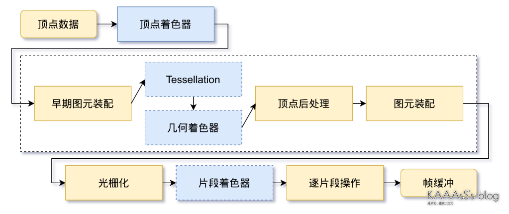
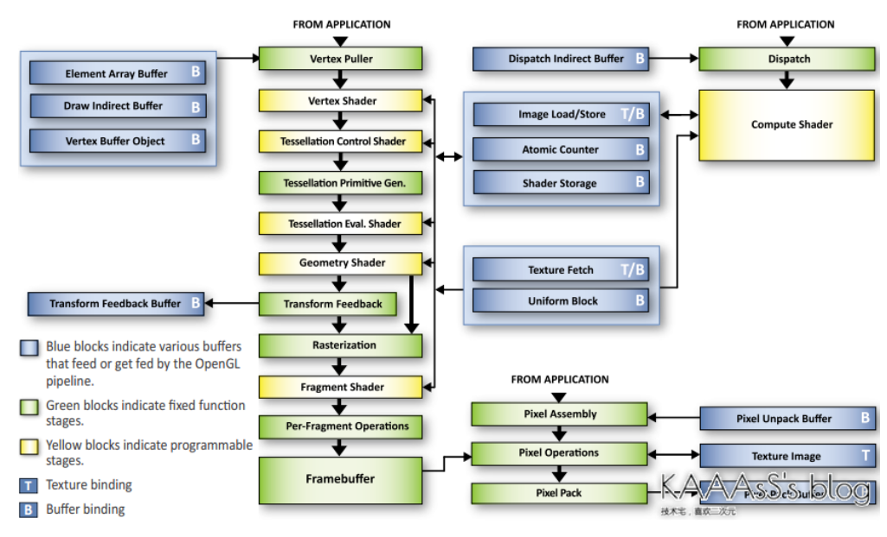
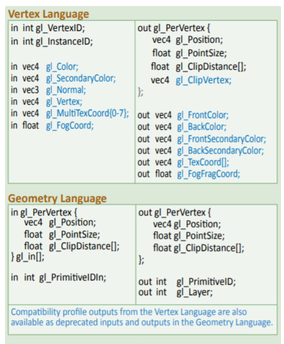
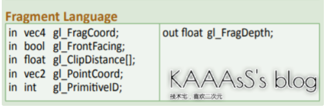
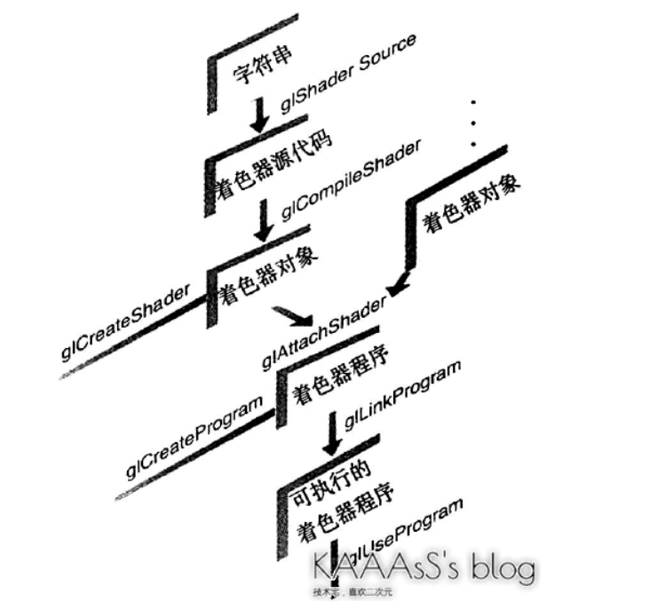
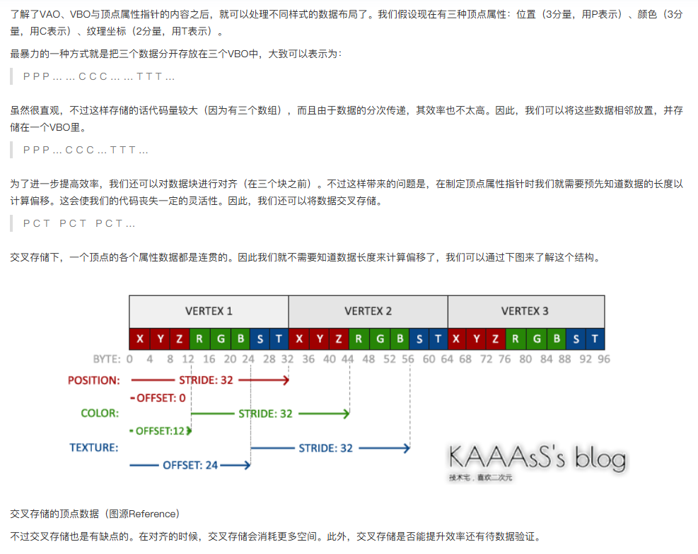
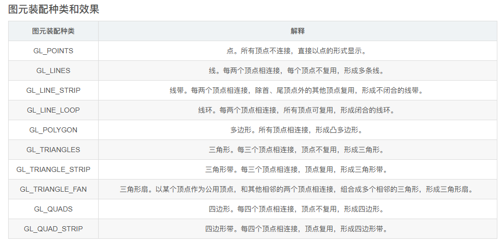
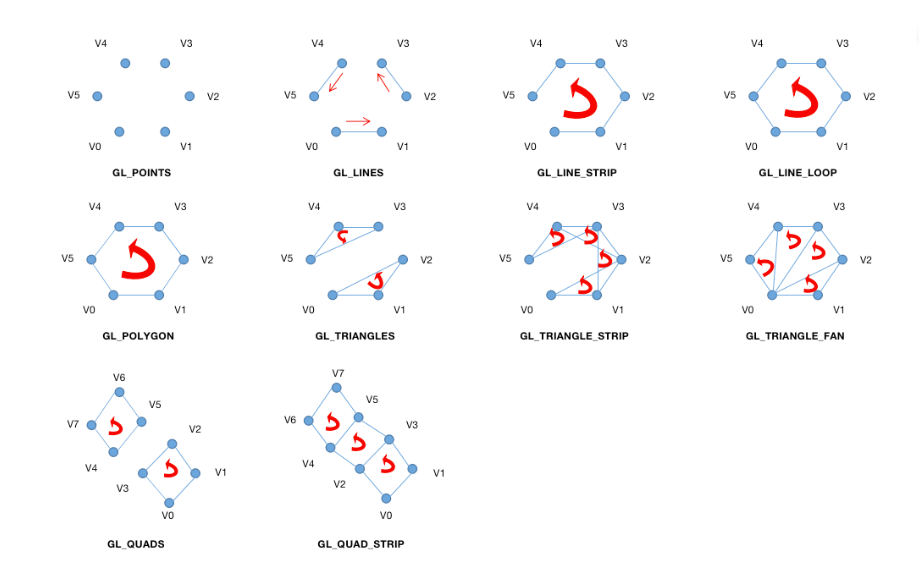

#### 渲染管线  
  
  

#### 渲染管线介绍
1. 顶点着色器: 将顶点位置转换为屏幕中的位置，此时得到是规范化设备坐标。OpenGL删除了所有固定功能的顶点操作，这一部分需要自己实现。如果使用了纹理，则纹理坐标的生成与变换(最终贴的位置)会在这个步骤完成；如果启用了逐顶点光照(per-vertex lignting)，光照相关计算也会在这一阶段完成。  
2. 早期图元装配(early primitive assembly)：图元装配的第一个步骤，根据绘制指令指定的顶点连接方式将顶点组装成图元(点，线，三角形)，因为在曲面细分(Tessellation)和几何着色阶段会对基本图元进行操作，所以这里需要进行提前装配，因而叫做早期。
3. 曲面细分(Tessellation)：对多边形进行切分，OpenGL实际只能处理三角形，对于多边形需要切分转换成三角形，此过程还会优化存储减少储存图形需要的顶点数。复杂的图形称为面片(patch)，由至少三个顶点组成。细分操作还可以按照特定的步骤进行，例如按照函数或者材质，从而提升图形的细节。
4. 几何着色器：可以增加或者删除图元，这个阶段的操作对象是图元，虽然作用与曲面细分类似，但是功能限制更大。
5. 顶点后处理：顶点处理的最终阶段，主要负责把顶点处理(vertex processing，包括顶点着色器，Tessellation，几何着色器)的结果转换为最终的屏幕空间坐标(screen space coordinates)
6. 变换反馈(transform feedback)：一个回馈过程，这一步骤中可以将之前处理过的图元数据保存下来，方便在下一次渲染时直接使用这些数据。
7. 裁剪：剔除屏幕范围外的点，可能会产生新的点，例如裁剪一个部分在屏幕内的图形，需要在屏幕边缘补向上新的点，避免裁剪后无法构成图形。
8. 透视除法：将投影后的齐次坐标进行处理，通过这个步骤，物体会产生近大远小的效果。  
9. 视口变换：视口变换中坐标被转换成真实的屏幕坐标，坐标的z分量转换成深度信息。
10. 图元装配：包含若干步骤，通过图元装配，顶点数据会被转换为完整的几何图元，也就是根据颜色，深度等进行了变化和裁剪的顶点。由于早期做了图元装配的工作，此时主要进行面剔除。
11. 面剔除：经过顶点处理后，已经知道了图元在屏幕上的真实坐标，因此，可以判断某个面是否朝向屏幕，这一步可以剔除背向屏幕的面，减少后续渲染负担。
12. 光栅化: 接受几何数据，像素数据，并把他们转换为片段(fragment)，这一步骤中会考虑图元的绘制方式，决定片段的多少，将图元转换成多个片段的位置信息，之后会对每个片段的颜色信息和深度信息进行计算(根据顶点数据进行插值)。简言之，就是把各种形状像素化，同时，还会进行抗锯齿计算。如果使用了纹理坐标，这部分也会执行纹理坐标的计算，对每一个片段计算其索引的纹理像素。  
13. 片段着色器：对光栅化处理完的片段进行处理，更改片段的属性。简言之，就是执行用户自定义的片段操作，通常会计算出一个片段的颜色。
14. 逐片段操作: 经过光栅化后，已经得到了若干片段，但这些片段不能直接送往帧缓冲区。例如物体重叠的情况，此时将会得到若干相同位置的片段，因此需要对这些片段进行操作。在这些操作中，测试通常用于舍弃片段，包括裁剪测试，alpha测试，深度测试，模版测试等。测试之后还会进行混合，抖动，逻辑操作，掩码等复杂的处理。简言之，片段操作的结果就是屏幕上显示的有一个个像素了，他们将会被送到帧缓冲区里去。
15. 帧缓冲：帧缓冲是渲染结果显示到屏幕的内容缓存。通常情况下，程序采用双缓冲(double buffer)，如果只采用一个缓冲，渲染新的一帧的过程中写入时新数据与旧数据混杂，会导致画面撕裂。前缓冲区用来保存供屏幕显示的内容，后缓冲区用于渲染程序的绘制操作，新一帧的渲染结束之后，交换两个缓冲区的内容。  
16. GLSL版本从330开始与OpenGL版本对应，例如OpenGL 3.3，则GLSL版本为330。  

#### GLSL内置变量，蓝色部分不建议使用  
  
  

#### uniform
uniform是向着色器程序传递额外数据的接口(例如纹理数据)，通过glUniform系列函数可以将数据提供给相关的着色器程序，uniform也可以是结构体，在GLSL中通过声明uniform块的方式接受结构体。  

#### GLSL编译过程  

#### 几何图元
OpenGL中有若干几何图元，但是最终这些图元都会转化成点，线，三角形，通过组合三角形，OpenGL还额外提供了条带和扇面。在OpenGL中，多边形区分正面和背面，默认情况下，两面的绘制方式相同，但是可以通过glPolygonMode更改为点集，轮廓线，填充模式。绘制多边形时，除了要提供顶点坐标等数据，还需要指定顶点之间的连接方式，OpenGL中采用了数学中"正向"的概念，也就是说对应凸多边形的正面，从屏幕观察，他的顶点是以逆时针排列的。

#### OpenGL缓冲
使用glGenBuffers(或者glCreateBuffer)可以创建一个缓冲区对象，之后必须使用glBindBuffer来绑定要使用的缓冲对象([glBindBuffer绍](https://registry.khronos.org/OpenGL-Refpages/gl4/html/glBindBuffer.xhtml))。绑定对象时，我们把一个缓冲对象绑定到一个确定的目标上，目标可以是GL_ARRAY_BUFFER代表的顶点数据类型等等，这里要注意的是glBindBuffer是一个状态设置函数，因此GL_ARRAY_BUFFER并不是缓冲类型，而是一个目标对象。glBufferData用于将数据从CPU传输到GPU中。

#### 顶点缓冲对象VBO
VBO仅仅一个将所有二进制顶点数据进行储存，不具有任何语义，只是二进制的形式缓存，因此不可以直接进行绘制。

#### 顶点数组对象VAO
VAO中的顶点数据虽然已经具有组织形式，因此可以用于绘制指令。通过glGenVertexArray创建VAO,glBindVertexArray进行绑定。由于现代OpenGL的顶点数据都存在于缓冲对象中(曾经可以使用glVertexPointer)，所以现在VAO已经不带有顶点数据了，因此，他需要绑定一个VBO。我们则需要给出如何解释VBO中的数据，通过顶点属性指针(vertex attribute pointer)。通过glVertexAttributePointer函数，可以向当前VAO中添加顶点属性指针。该函数的第一个参数用于区分一个顶点数据中的不同属性，例如一个顶点数据中可能包含了坐标，纹理坐标等属性。配置好顶点属性后，通过glEnableVertexAttribArray启用配置

#### 数据布局

#### VAO和VBO的关系  

#### OpenGL渲染管线各阶段的输入与输出
1. 顶点着色器：主要目的是进行MVP变换，也可以对其他基本属性进行一些设置
	- 输入：顶点数据(位置，法线，颜色，纹理坐标等)
	- 输出：处理后的顶点数据(位置(MVP变换),纹理坐标，颜色等)
2. 图元装配：
	- 输入：顶点着色器输出
	- 输出：图元(点，线，三角形...)
3. 几何着色器：以一组顶点作为输入，这些顶点可以生成图元，在该阶段中可以生成新的形状或者更多的图元
	- 输入：图元
	- 输出：生成的新的图元(曲面细分)或输入的图元(未处理)
4. 裁剪和视口变换：
	- 输入：图元
	- 输出：裁剪后的图元
5. 光栅化：
	- 输入：裁剪后的图元
	- 输出：片段(所谓片段指的是绘制一个像素所需要的全部信息，包括光照，阴影，光线颜色等)
6. 片段着色器：
	- 输入：片段
	- 输出：像素颜色
7. 测试与混合
	- 输入：像素颜色
	- 输出：像素最终颜色
  
  

