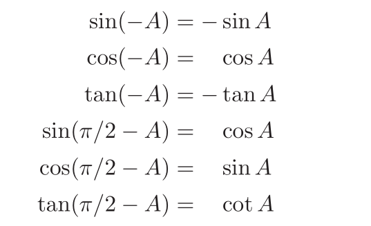

#### 性能优化建议:
1. 用最简单的方式写代码。根据需要动态计算中间结果，而不是存储它们。
2. 在优化模式下编译。
3. 使用现有的任何分析工具来发现关键瓶颈。
4. 检查数据结构以寻找改进局部性的方法。如果可能，请使数据单元大小与目标体系结构上的该高速缓存/页面大小相匹配。
5. 如果分析揭示了数值计算中的瓶颈，请检查编译器生成的汇编代码，以查找效率低下的问题。重写源代码以解决您发现的任何问题。

#### 代码编写建议
1. 图形程序中应当具有定义良好的结构体，例如位置，点，向量，RGB，矩阵
2. 向量：向量加法，向量减法，点积，叉积，标量乘法，标量除法，使用一个二维数组或三维数组
3. RGB：三维数组，RGB加法，RGB减法，RGB乘法，标量乘法，标量除法
4. 矩阵变换操作函数，归一化操作，正交矩阵...
5. 建议使用double进行几何计算，使用float进行RGB计算，对于占用大量内存的数据，例如三角形网格，建议存储为float，但是通过成员函数访问时转换成double。也有一种建议是在所有程序中使用float，只有在特定部分才使用double。

#### 三角函数
- 三角函数具有周期性，因此，反三角函数是一个多值函数，即输入x对应多个y，为了得到定义域和值域的一对一关系，将定义域划分为每一段小区间(-π/2 + nπ, π/2 + nπ)(n = 0,1,2...)，定义域区间选取必须是单调的，并且最好是连续的（反正割和反余割是间断的）。
1. 反正弦函数，反余弦函数：  

2. 反余切函数，反正切函数：  
‘
3. 常用三角恒等式：  
  
    
  
  
  

毕达哥拉斯定理：  
  

海伦公式：  
  

##### 术语
1. 一个角度的定义：由在单位圆上切出的弧线段进行定义。单位圆的周长是2π且对应的弧度是2π，所以弧度就是单位圆上的弧线段的长度。  
2. 向量：可以用来代表一段位移，代表一个点或者位置，通常会有一个位置作为起点，其他任何位置视为从该起点的位移。注意区分理解位移和位置的区别，两个位移进行相加有意义，但是两个位置相加没有意义。
3. 向量相加遵循平行四边形法则，但是，平行四边形仅仅只是形式化了我们对向量相加的直观感受。  
4. 正交向量：点击为0的向量正交  
5. 正交基：n维向量空间，有n个单位向量并且他们之间两两垂直，这一组向量称为标准正交基
6. 点P：坐标a,b,c分别是三个标准坐标基的系数，然而，位置的完整形式：ax + by + cz + origin(o)，原点通常是(0,0,0)。
7. 点P(x,y,z)的坐标也是在该坐标空间标准坐标基上的投影，因为坐标基是单位向量，所以计算坐标可以使用点积，即p分别与标准坐标基进行点积运算。

#### 向量点积与乘积
##### 点积
- 结果是一个标量，所以也叫标量积
- 遵循交换律，结合律，分配律
- 使用方式：  
    - 求两个向量之间的夹角
    - 求一个向量在另一个向量上的投影
    - 求向量长度
    - 判断两个向量是否平行，判断两个向量是否同向
    - 判断两个向量是否正交，若向量正交，则向量的点积为0
    - 判断两个向量的夹角是否位于正负π/2
    - 如果两个向量是单位向量，那么向量点积就是向量之间的夹角
-  用点积表示曲线：
    -  圆：p(x,y)为平面上一个向量，圆心c(a,b)，半径r。则有：(p  - c)  dot (p  - c) - r^2 = 0。可以理解为在圆上的点，满足条件：从圆心到该点形成的空闲向量与自己的点积结果为r^2，因此，也可以表示为：| p -  c | - r = 0

#### 叉积
- 结果是向量。所以也叫向量积
- |axb| = |a| x |b| x sin(夹角)
- 叉积的大小 = 两个向量形成平行四边形的面积大小
- 同时垂直于a, b向量的向量具有两个方向，具体方向与右手定则相关
- 一个向量和自己的叉积得到一个长度为0的向量，也就是零向量
- 因为遵循右手定则，所以不满足交换律，满足结合律和分配律

#### 梯度
- 梯度指向函数变化最快的方向。在局部极大值和局部极小值处为0。对于单一变量的函数，梯度就是斜率。对于多个输入变量，梯度对应一个输出变量
- 假设函数F(x, y, z)，其梯度可以表示为一个向量(dF/dx, dF/dy, dF/dz)。
- 注意梯度完全区别于坐标，坐标是一个确切的位置，而梯度仅仅是告知运动方向，可以是任意方向，限制条件仅仅是该方向是函数值变化最大的方向。  
  

#### 问题
1. 从单个向量构造基：给定一个向量a，求一组标准正交基u,v,w(并不关心u,v)并且w与a指向相同的方向
    - 求w：a / |a|
    - 求u: 取向量t，且t与a不共线，通过叉积计算(t x a) / | t x a|即可
    - 求v: 叉积计算 w x u;
    - 应用：表面着色过程，需要与表面法向量对齐的基向量w，但是u,v此时不重要
2. 从两个向量构造基2：
    应用： 已知相机的朝向以及looking的方向，求解另一个正交基向量

    